# Agentic Development Workflow

### Your AI Development Team, Working Together

---

> **What if you could give a task to a team of AI specialists -- an architect, a developer, a code reviewer, a chaos engineer, and a technical writer -- and they would plan, challenge, build, verify, and document the work, checking in with you at every critical decision?**

That is what the Agentic Development Workflow does. It orchestrates multiple AI agents, each with a distinct role and personality, to take a software task from idea to implementation with built-in quality gates and human oversight.

This document explains the workflow for **managers, team leads, stakeholders, and anyone curious** about how structured AI-assisted development works -- no programming knowledge required.

---

## Table of Contents

- [The Big Picture](#the-big-picture)
- [How It Works: The Assembly Line](#how-it-works-the-assembly-line)
- [Meet the Team](#meet-the-team)
- [The Workflow Step by Step](#the-workflow-step-by-step)
- [Human Checkpoints: You Stay in Control](#human-checkpoints-you-stay-in-control)
- [Workflow Modes: Right-Sizing the Process](#workflow-modes-right-sizing-the-process)
- [Specialist Agents: Called When Needed](#specialist-agents-called-when-needed)
- [Cross-Platform Support](#cross-platform-support)
- [Configuration: Tuning the Process](#configuration-tuning-the-process)
- [Advanced Capabilities](#advanced-capabilities)
- [Getting Started](#getting-started)
- [Frequently Asked Questions](#frequently-asked-questions)

---

## The Big Picture

Traditional software development follows a pattern: someone designs a solution, someone builds it, someone reviews it, and someone documents it. Each step catches different kinds of problems.

The Agentic Development Workflow **replicates this proven process using AI agents**, where each agent has a focused specialty. Instead of one AI trying to do everything at once, the work flows through a structured pipeline -- the same way a well-run engineering team operates.

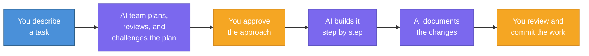

**Key insight:** The human stays in the driver's seat. AI agents do the heavy lifting, but you make the decisions at every important junction.

---

## How It Works: The Assembly Line

Think of it like an automotive assembly line, but for software. Each station has a specialist who focuses on one thing and does it exceptionally well. The work moves forward only when the current station is satisfied.

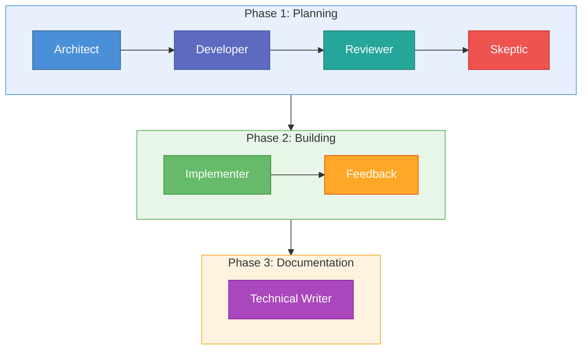

The three phases ensure that **no code is written until the plan has been thoroughly vetted**, and no code is committed until it matches the approved plan.

---

## Meet the Team

Each AI agent has a distinct personality, focus area, and set of permissions. Here is who does what, explained through real-world analogies.

### The Core Seven

| Agent | Role Analogy | What They Do | Permissions |
|-------|-------------|--------------|-------------|
| **Architect** | Chief Engineer reviewing blueprints | Evaluates how the task fits into the overall system. Identifies risks, dependencies, and constraints. Sees the big picture. | Read-only |
| **Developer** | Senior Engineer writing the spec | Creates a detailed, step-by-step implementation plan based on the Architect's guidance. Like writing a recipe before cooking. | Read-only |
| **Reviewer** | Experienced PR Reviewer | Checks the plan for completeness, correctness, and gaps. Catches what the Developer might have missed. | Read-only |
| **Skeptic** | QA Engineer + Chaos Engineer | Tries to break the plan on paper. Finds every way it could fail -- edge cases, race conditions, what happens at 3 AM on a Sunday. | Read-only |
| **Implementer** | Developer writing the code | Executes the approved plan step by step, running tests after each step. The only agent that actually writes code. | Read & Write |
| **Feedback** | Project Manager at a checkpoint | Compares what was actually built against what was planned. Detects deviations, assesses severity, and recommends whether to continue, adjust, or restart. | Read-only |
| **Technical Writer** | Documentation specialist | Updates project documentation to capture new knowledge, patterns, and decisions. Keeps the knowledge base current. | Read & Write |

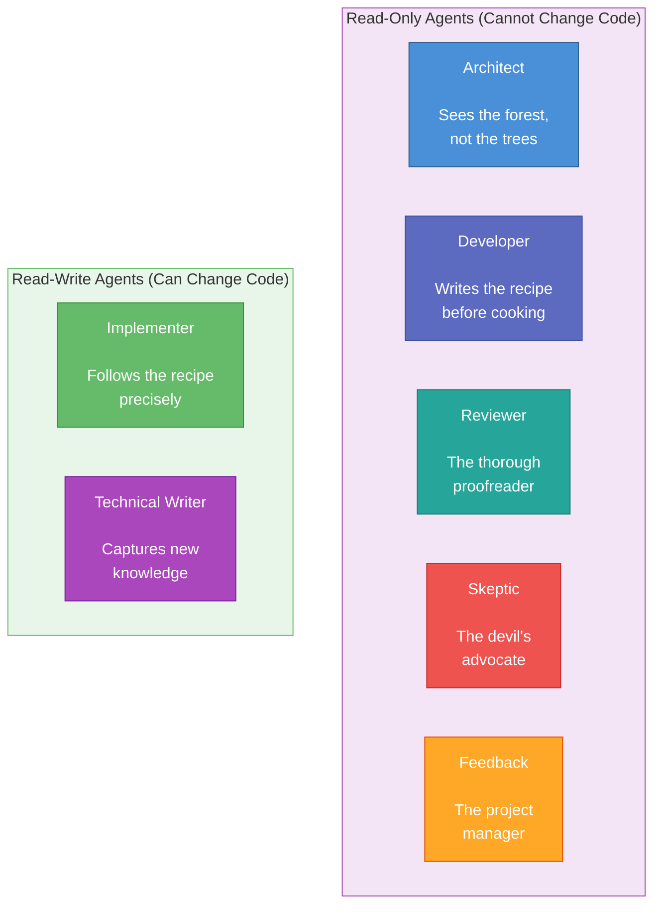

**Notice:** Five of the seven agents are **read-only** -- they can look at the code and analyze it, but they cannot change anything. This separation of concerns is a deliberate safety measure. Only the Implementer and Technical Writer can modify files, and both follow plans that have been reviewed and approved.

---

## The Workflow Step by Step

Here is the full journey of a task from start to finish.

### Phase 1: The Planning Loop

Planning is not a single pass -- it is an iterative loop. If the Reviewer or Skeptic finds significant problems, the plan goes back for revision.

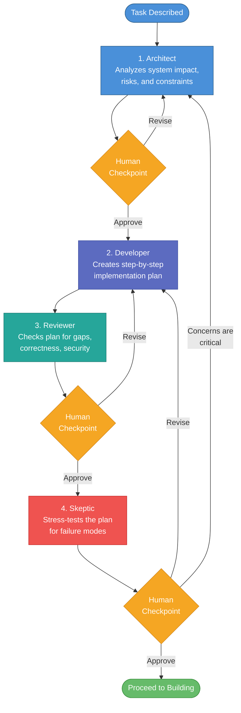

**Why iterate?** The first plan is rarely perfect. By having multiple specialists review and challenge it *before* any code is written, most problems are caught on paper -- where they are cheap to fix -- rather than in code, where they are expensive.

### Phase 2: The Implementation Loop

Once the plan is approved, the Implementer builds it step by step. After each step, tests run automatically. At configurable milestones, the Feedback agent checks that the work matches the plan.

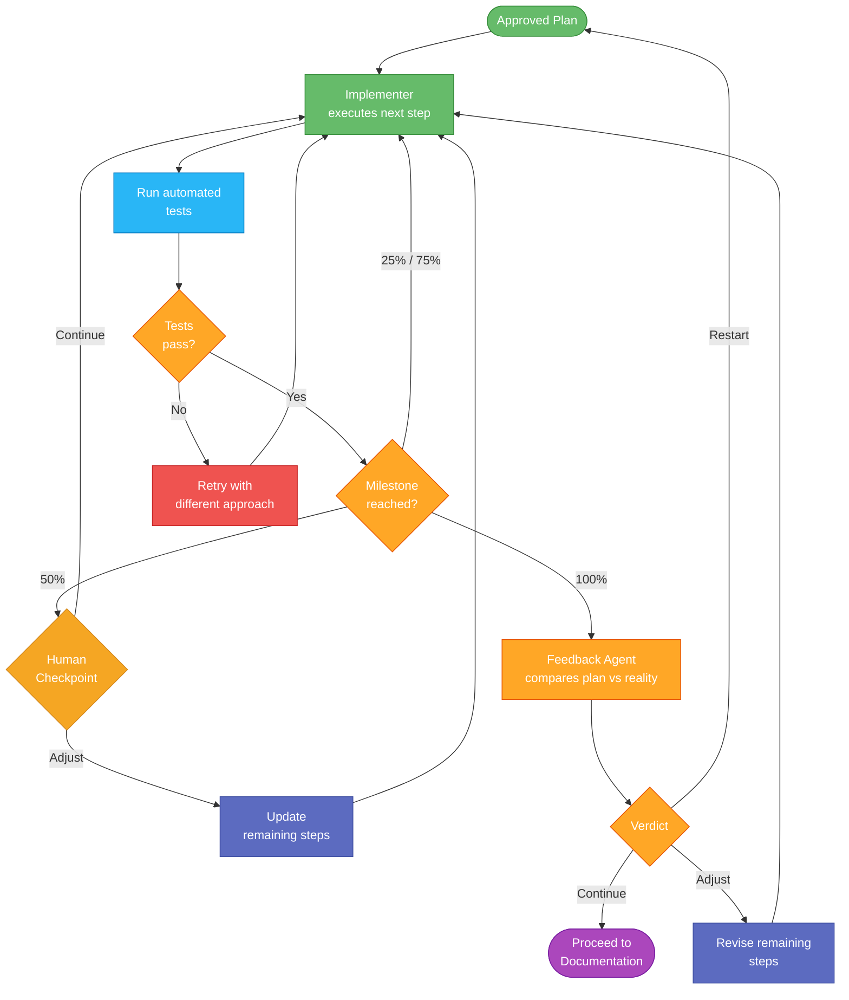

**Key safeguard:** If an implementation step fails its tests repeatedly, the system escalates to the human rather than continuing in a broken state.

### Phase 3: Documentation

The Technical Writer agent reviews all the changes that were made and updates the project's documentation accordingly -- capturing new patterns, decisions, and knowledge so the next task benefits from what was learned.

---

## Human Checkpoints: You Stay in Control

One of the most important design principles is that **humans remain in the decision loop**. The system pauses at configurable checkpoints and asks for your input.

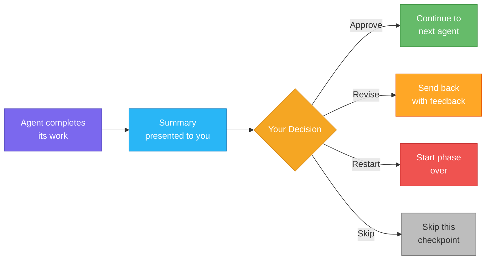

### Default Checkpoint Configuration

| Checkpoint | Default | Why It Matters |
|-----------|---------|----------------|
| After Architect | Enabled | Review system-wide concerns before detailed planning begins |
| After Developer | Disabled | Plan goes straight to Reviewer for validation first |
| After Reviewer | Enabled | Review gaps and issues found before the Skeptic stress-tests |
| After Skeptic | Enabled | Final review of edge cases before committing to building |
| At 50% implementation | Enabled | Mid-build sanity check -- is it on track? |
| Before commit | Enabled | Always review before changes become permanent |
| On deviation detected | Enabled | Alert when implementation drifts from the plan |
| After Technical Writer | Enabled | Review documentation updates before they are applied |

All checkpoints are configurable. You can enable or disable any of them, tailoring the level of human involvement to your team's needs and comfort level.

### Additional Safety Triggers

Beyond scheduled checkpoints, the system will **automatically escalate** to you if it detects:

- Implementation deviating significantly from the approved plan
- Tests failing unexpectedly
- Scope creep -- the work expanding beyond the original task
- Security concerns
- Repeated failures on the same step

---

## Workflow Modes: Right-Sizing the Process

Not every task needs the full seven-agent treatment. A simple typo fix does not require an Architect's review. The workflow supports four modes that match the process to the task's complexity.

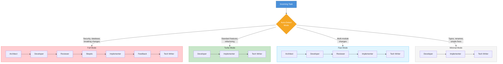

### Mode Comparison

| Mode | Agents Used | Best For | Estimated Cost |
|------|------------|----------|---------------|
| **Full** | All 7 agents | Security changes, database migrations, API changes, critical systems | $0.50+ |
| **Fast** | 5 agents (skip Skeptic & Feedback) | Multi-module changes that need architectural review | ~$0.25 |
| **Turbo** | 3 agents (Developer, Implementer, Writer) | Standard features, refactoring, new functionality | ~$0.15 |
| **Minimal** | 3 agents (Developer, Implementer, Writer) | Typo fixes, renames, comment updates | ~$0.10 |

### Auto Mode

By default, the system runs in **Auto** mode, which analyzes your task description and picks the right workflow mode automatically. For example:

- *"Fix the typo in the README"* -- selects **Minimal**
- *"Add a caching layer to the API"* -- selects **Turbo**
- *"Implement OAuth2 authentication"* -- selects **Full** (because it involves security)
- *"Refactor the payment module"* -- selects **Fast** or **Full** depending on scope

You can always override this by specifying the mode explicitly.

---

## Specialist Agents: Called When Needed

In addition to the core seven agents, there are **specialist agents** that activate automatically when the task involves their area of expertise.

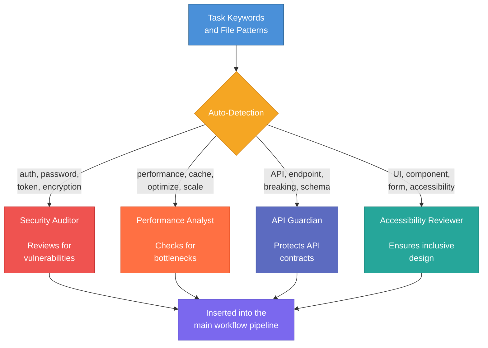

| Specialist | Triggered By | What They Check |
|-----------|-------------|-----------------|
| **Security Auditor** | Keywords like *auth*, *password*, *token*, *encryption*; or files in auth/security folders | Authentication flaws, data exposure, injection vulnerabilities, secrets in code |
| **Performance Analyst** | Keywords like *performance*, *cache*, *optimize*, *scale*; or database/query files | Slow queries, missing caching, N+1 problems, scalability bottlenecks |
| **API Guardian** | Keywords like *API*, *endpoint*, *schema*, *breaking change*; or API/routes files | Backward compatibility, contract changes, versioning, deprecation |
| **Accessibility Reviewer** | Keywords like *UI*, *component*, *form*, *accessibility*; or frontend component files | Screen reader support, keyboard navigation, color contrast, WCAG compliance |

These specialists are **automatically detected** based on the task description and the files being changed. They can also be enabled or disabled manually.

---

## Cross-Platform Support

The Agentic Development Workflow works across three major AI coding platforms:

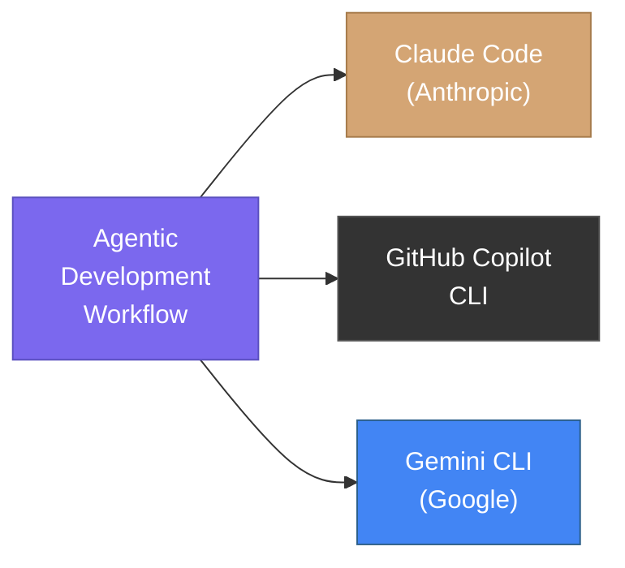

The same agent definitions and workflow configuration work regardless of which platform you use. This means:

- **No vendor lock-in** -- switch between platforms freely
- **Consistent process** -- the workflow behaves the same everywhere
- **Team flexibility** -- different team members can use different platforms

---

## Configuration: Tuning the Process

The workflow is highly configurable through a simple settings file (YAML format). Configuration follows a **cascade** -- each level can override the one before it.

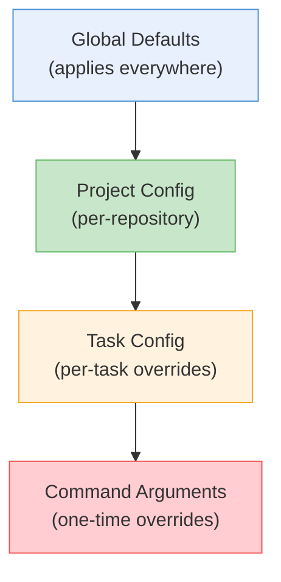

**What this means in practice:**

1. **Global defaults** set the baseline for all projects (e.g., "always pause before committing")
2. **Project config** customizes for a specific codebase (e.g., "this project needs the Security Auditor always on")
3. **Task config** adjusts for a specific piece of work (e.g., "use Full mode for this task")
4. **Command arguments** let you override anything on the fly (e.g., "run with loop mode this time")

### What Can Be Configured?

| Category | Examples |
|----------|---------|
| **Checkpoints** | Which human approval points are active |
| **Workflow mode** | Which agents are included in the pipeline |
| **AI models** | Which AI model each agent uses |
| **Auto-actions** | What agents can do without asking (run tests, create files, etc.) |
| **Iteration limits** | Maximum retries before escalating to a human |
| **Cost tracking** | Token usage and cost reporting |
| **Integrations** | Jira issue tracking, Beads issue linking |

---

## Advanced Capabilities

Beyond the core workflow, the system includes several advanced features for teams that need them.

### Parallel Workflows with Git Worktrees

Teams can run **multiple workflows simultaneously** on different tasks, each in its own isolated branch. This is like having multiple workbenches -- each task gets its own clean workspace without interfering with others.

### Gemini Research Integration

For large codebases, the system can use Google's Gemini (which has a massive context window) to pre-analyze the codebase and provide focused context to each agent. This makes the agents smarter about the specific project they are working on.

### Cross-Task Memory

The system **learns across tasks**. Decisions, patterns, gotchas, and blockers discovered during one task are saved and can inform future tasks. This means the AI team gets better at working with your codebase over time.

### Error Pattern Learning

When a specific error is encountered and solved, the solution is recorded. If the same error appears in a future task, the system can suggest the known fix automatically.

### Cost Tracking

Every agent's token usage and estimated cost is tracked and reported at the end of each workflow, giving full transparency into resource consumption.

### Model Resilience

If an AI model is temporarily unavailable (rate limits, outages), the system automatically falls back to alternative models with exponential backoff and retry logic. Work is not lost due to transient failures.

---

## Getting Started

Getting started with the Agentic Development Workflow is straightforward.

### Step 1: Install

The workflow is installed as a plugin for your AI coding assistant. Installation scripts are provided for each supported platform.

### Step 2: Start a Workflow

Once installed, you interact with the system through simple commands in your terminal:

| Command | What It Does |
|---------|-------------|
| `/crew start "Add user login"` | Start a new workflow with a task description |
| `/crew status` | Check the status of all active workflows |
| `/crew resume` | Resume a paused workflow |
| `/crew ask architect "Is this approach safe?"` | Consult a single agent without starting a full workflow |
| `/crew config` | View your current configuration |

### Step 3: Follow the Checkpoints

The system guides you through the workflow. At each checkpoint, you will see a summary of what the agent found and be asked how to proceed. Your options are always clear:

- **Approve** -- move forward
- **Revise** -- send it back with your feedback
- **Restart** -- start the phase over

### Step 4: Review and Commit

When the workflow completes, you review the changes and approve the final commit. The system generates a commit message summarizing what was done.

---

## Frequently Asked Questions

### General

**Q: Do I need to be a developer to use this?**
A: You need to be working in a software development context, but you do not need to understand the code the AI is writing. The checkpoints present information in plain language, and you can always ask a specific agent for clarification using `/crew ask`.

**Q: How much does it cost per task?**
A: It depends on the workflow mode and the complexity of the task. Simple fixes (Minimal mode) cost around $0.10 in AI tokens. Complex features (Full mode) typically cost $0.50 or more. The system tracks and reports exact costs for every workflow.

**Q: Can the AI make changes I did not approve?**
A: No. The system is designed with configurable checkpoints, and by default, it pauses before committing any changes. Git operations (staging, committing, pushing) require explicit human approval by default.

**Q: What happens if the AI gets stuck?**
A: The system has built-in escalation. If an agent fails repeatedly, exceeds its iteration limit, or encounters something unexpected, it pauses and asks for human input rather than continuing blindly.

### About the Agents

**Q: Why separate agents instead of one AI doing everything?**
A: For the same reason engineering teams have specialists. An architect thinks differently than a QA engineer. By giving each agent a focused role and specific instructions, the output is more thorough and catches more issues than a single-pass approach. The Skeptic, for example, is specifically prompted to think about failure modes -- something a "do everything" agent tends to gloss over.

**Q: Can the Skeptic or Reviewer block the workflow?**
A: They can raise concerns that trigger a human checkpoint, but they cannot block the workflow on their own. The human always makes the final decision about whether to proceed, revise, or restart.

**Q: What if I disagree with an agent's assessment?**
A: At any checkpoint, you can override the agent's recommendation. You can approve despite concerns, send the plan back for revision with your own guidance, or skip the checkpoint entirely.

### Technical

**Q: Does this work with any programming language?**
A: Yes. The workflow is language-agnostic. The AI agents can work with any programming language that the underlying AI model supports, which includes all major languages.

**Q: Can I customize which agents are used?**
A: Absolutely. The workflow modes control which agents run, and you can define custom configurations per project or per task. You can also enable or disable specialist agents as needed.

**Q: Is my code sent to external services?**
A: The workflow uses the same AI services (Claude, Gemini, Copilot) that your team already uses for AI-assisted coding. No additional services are involved. Your code goes only to the AI provider you have chosen.

**Q: Can multiple people use this on the same project simultaneously?**
A: Yes. The git worktree support allows multiple workflows to run in parallel on isolated branches, avoiding conflicts.

### Process

**Q: How does this compare to a human code review?**
A: It complements rather than replaces human review. The AI agents catch many mechanical issues (missed edge cases, inconsistencies with project patterns, common security mistakes) quickly and consistently. Human reviewers can then focus on higher-level concerns like business logic correctness and design decisions.

**Q: Can I use only parts of the workflow?**
A: Yes. You can consult any individual agent using `/crew ask <agent> "question"` without starting a full workflow. You can also configure Minimal mode for simple tasks that only need planning, implementation, and documentation.

**Q: What if I want to add my own custom agents?**
A: Agent definitions are markdown files with instructions. Adding a new specialist agent involves creating a new markdown file and configuring its trigger conditions in the workflow configuration.

---

## Summary

The Agentic Development Workflow brings **structured, multi-specialist AI collaboration** to software development. Instead of treating AI as a single tool that does everything, it creates a team of focused specialists that plan, challenge, build, verify, and document -- with humans making the key decisions throughout.

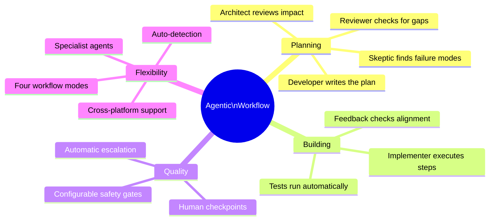

**The result:** Higher quality software changes, delivered faster, with full transparency and human oversight at every critical decision point.

---

<em>Agentic Development Workflow is open source and available on <a href="https://github.com/Spiris-Innovation-Tech-Dev/agentic-workflow">GitHub</a>.</em>

